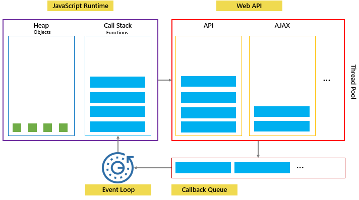

### JavaScript Runtime



### Visualizing the Runtime

Demo [(link)](http://latentflip.com/loupe/?code=DQoNCmZ1bmN0aW9uIGZvbygpIHsNCiAgICBiYXIoKTsNCn0NCg0KZnVuY3Rpb24gYmFyKCkgew0KICAgIGJheigpOw0KfQ0KDQpmdW5jdGlvbiBiYXooKSB7DQogICAgc2V0VGltZW91dChwcmludEhlbGxvLCAzMDAwKTsNCn0NCg0KZnVuY3Rpb24gcHJpbnRIZWxsbygpIHsNCiAgICBjb25zb2xlLmxvZygnSGVsbG8gZnJvbSBiYXonKTsNCn0NCg0KZm9vKCk7!!!)

### Never block the thread

- The browser uses JS to respond to user input
- JS is single-threaded
- If JS is churning, it can't respond to user input

```javascript
for (let i = 0; i < 5000000000; i++) {} // bad times
```

See demo at <http://localhost:3000/js/browser/webworkers-demo/index.html>

### Code that runs out of order

In what order to these statements print out?

```javascript

console.log('One')

const doIt = () => {
  console.log('Two')
  setTimeout(() => {
    console.log('Three')
  }, 2000)
  console.log('Four')
}

console.log('Five')
doIt()
```
