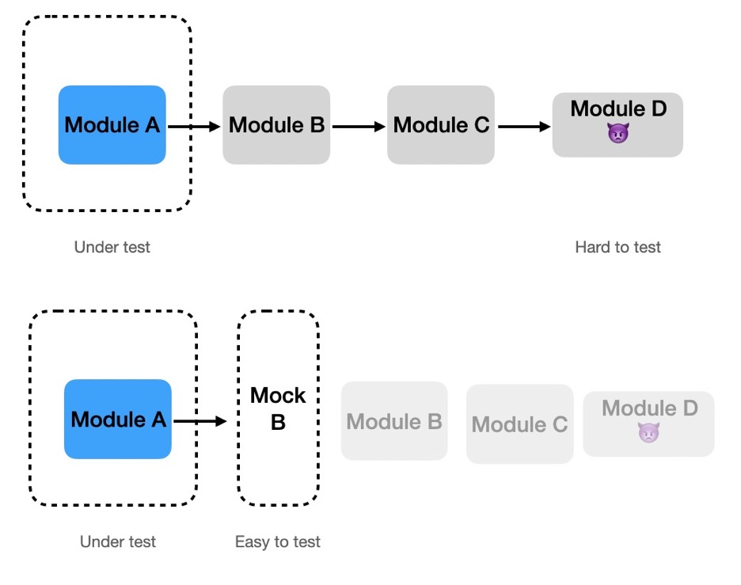

### Mocking Modules (Basic)

Say you're testing a module, and you want to mock its dependency.

```javascript
// add.js
import { somethingComplicated } from './dependency'

export const weirdMath = (a, b) => (
  somethingComplicated() ? a + b : a - b
)

// dependency.js
export const somethingComplicated = () => (
  Math.random() < 0.5 ? true : false
)
```

### Mocking Modules (Basic)

You can mock all the exports of a module from your test file:

```javascript
jest.mock('./path/to/module/to/be/mocked')
```

This turns all exports into `jest.fn()`

### Mocking Modules (Basic)

You can even refer to it directly and it'll still
be the mocked version!

```javascript
// add.spec.js
import { weirdMath } from '../add'
import { somethingComplicated } from '../dependency'

jest.mock('../dependency')

somethingComplicated() // undefined
```

### Mocking Modules (Basic)

So you can then control the dependency:

```javascript
import { weirdMath } from '../add'
import { somethingComplicated } from '../dependency'

jest.mock('../dependency')

it('should add or subtract', () => {
  somethingComplicated.mockReturnValue(true)
  expect(weirdMath(5, 2)).toEqual(7)

  somethingComplicated.mockReturnValue(false)
  expect(weirdMath(5, 2)).toEqual(3)
})
```

### Mocking Modules (Basic)

`jest.mock` applies to _the whole file_

```javascript
describe('this will not do what you think', () => {
  jest.mock('./do/not/do/this')
  it(/* ... */)
})
```

There are many creative ways around this limitation
but we'll leave it at this for now.

### Mock modules to simplify your tests

You will invariably run into weird problems:


### Mock modules to simplify your tests


### Mock modules to simplify your tests



### Mock modules to simplify your tests

For now, always just mock the nearest layer:


